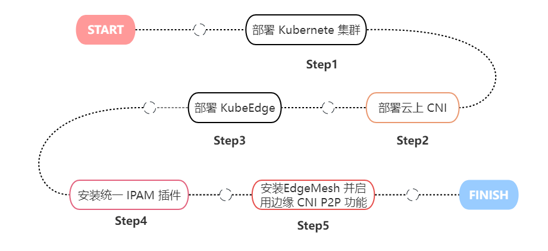
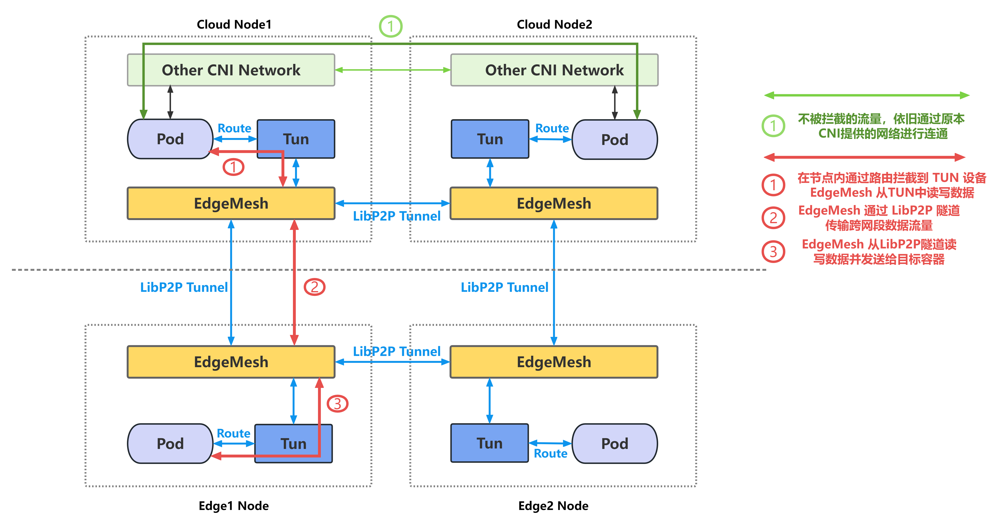

# EdgeMesh CNI  特性使用 


##  部署使用

此项功能主要为边缘容器提供基础 CNI 功能，在云上您依旧可以继续使用先前安装的 CNI 架构，而在边缘我们推荐您使用我们开发的 CNI 组件接入 IPAM以保证容器所分配到的 IP 地址是集群唯一的，如果边缘您依旧需要使用自己的 CNI 架构，就需要自己管理 IPAM 分配的容器地址之间不重复

您可以通过以下的步骤启用边缘 CNI 功能：



### 1. 安装统一 IPAM 插件

该步骤会在集群中部署统一的地址分配插件 [SpiderPool](https://github.com/spidernet-io/spiderpool) ,功能是兼容云边的 CNI 体系，为整个集群的容器分配唯一的 PodIP 地址；我们推荐使用 helm 一体化部署, 以下安装流程适应 v0.8 版本：

添加 spiderpool 仓库到 helm 当中

``` shell
helm repo add spiderpool https://spidernet-io.github.io/spiderpool
```

设置集群 PodIP 地址分配的参数，并在集群中部署 SpiderPool.


```shell
IPV4_SUBNET_YOU_EXPECT="10.244.0.0/24"
IPV4_IPRANGES_YOU_EXPECT="10.244.0.0-10.244.20.200"


helm install spiderpool spiderpool/spiderpool --wait --namespace kube-system \
  --set multus.multusCNI.install=false \
  --set multus.enableMultusConfig=false \
  --set coordinator.enabled=false \
  --set ipam.enableIPv4=true --set ipam.enableIPv6=false \
  --set clusterDefaultPool.installIPv4IPPool=true  \
  --set clusterDefaultPool.ipv4Subnet=${IPV4_SUBNET_YOU_EXPECT} \
  --set clusterDefaultPool.ipv4IPRanges={${IPV4_IPRANGES_YOU_EXPECT}}
```

上述配置参数中与 CNI 相关的参数为 ：

* `IPV4_SUBNET_YOU_EXPECT`  表示您设置的集群内容器所分配的 PodIP 地址，与使用 kubeadm 启动时候设置的 `--cidr` 参数含义一致
* `IPV4_IPRANGES_YOU_EXPECT` 表示您设置的集群集群内容器所分配的 PodIP 地址范围

以上两个参数的设置表示的容器IP地址包含云边的容器，您需要记住上述的地址分配情况，并在接下来启用边缘 CNI 功能过程中进行配置。 


### 2. 启用边缘 CNI 功能 

您可以通过以下配置的方式，在启动 EdgeMesh 时候启用 CNI 边缘 P2P 特性，配置过程中您可以依据对云边网段资源的划分需求来配置云边容器网络所处的区域：

``` shell
# 启用 CNI 边缘特性
helm install edgemesh --namespace kubeedge \
--set agent.relayNodes[0].nodeName=k8s-master,agent.relayNodes[0].advertiseAddress="{1.1.1.1}" \
--set agent.cloudCIDR="{10.244.1.0/24,10.244.1.0/24}",agent.edgeCIDR="{10.244.5.0/24,10.244.6.0/24}"
https://raw.githubusercontent.com/kubeedge/edgemesh/main/build/helm/edgemesh.tgz
```

上述配置的参数中 `cloudCIDR` 是云上容器集群分配的地址， `edgeCIDR` 是边缘容器集群分配的地址； EdgeMesh 会对比部署节点分配到的容器网段CIDR 与配置文件中是否属于不同网段，属于不同网段的地址会添加对应的 `ip route ` 规则拦截到 Tun 设备。

* `cloudCIDR` 参数是云上分配的容器网段，类型为 `[]string` ，形式为容器IP地址以及其子网掩码，表示一段虚拟网络区域，在区域内的容器应当网络二层可通，如果容器不能够通过二层设备访问，请划分为不同的容器网段。
* `edgeCIDR` 参数是边缘分配的容器网段，类型为 `[]string` ，形式为容器IP地址以及其子网掩码，表示一段虚拟网络区域，在区域内的容器应当网络二层可通，如果容器不能够通过二层设备访问，请划分为不同的容器网段。

| 名称                           | 参数类型 | 使用实例                                                     |
| ------------------------------ | -------- | ------------------------------------------------------------ |
| agent.meshCIDRConfig.cloudCIDR | []string | --set agent.meshCIDRConfig.cloudCIDR="{10.244.1.0/24,10.244.1.0/24}" |
| agent.meshCIDRConfig.edgeCIDR  | []string | --set agent.meshCIDRConfig.edgeCIDR="{10.244.1.0/24,10.244.1.0/24}" |

需要注意的是设置的地址必须为 CIDR 形式 ，同时需要您依据云边网络情况划分出对应的网段；另一方面本特性需要同时启动高可用特性，为跨网段的流量提供中继和穿透服务。

更多的安装配置信息请详见：

helm安装 : [Helm 安装 | EdgeMesh在新窗口打开](https://edgemesh.netlify.app/zh/guide/#helm-安装)

手动安装 : [快速上手 | EdgeMesh](https://edgemesh.netlify.app/zh/guide/)

> 需要注意的是EdgeMesh 默认不启用 CNI 特性，您如果没有在上述参数中指定 CIDR 的话集群内就不会启用 CNI 特性，边缘的节点会依赖原有的 CNI 架构(比如 Docker)来提供容器网络的连通性。


## 功能架构说明

​		EdgeMesh 致力于研究和解决边缘计算场景下跟网络连通、服务协同、流量治理等相关的一系列问题，其中在异构复杂的边缘网络环境内，不同物理区域的容器在面对动态变迁的网络环境以及短生命周期且跳跃变迁的服务位置，一部分服务可能需要使用 PodIP 进行跨网段通信，而主流的 CNI 方案并不支持跨子网流量的转发，致使这些容器即便在同一个集群内却没有享用一个平面的网络通信服务。

​		针对这个问题，在先前版本的 EdgeMesh 高可用特性中，EdgeMesh 提供了在分布式网络自治等边缘场景，为节点提供基于 Service 的中继流量以及网络穿透服务，但还没有完全支持对 PodIP层次流量的转发和穿透服务。也就是说在云边混合的场景当中 ，EdgeMesh 能够为跨网段的Service 流量提供穿透服务，但是仍旧依靠集群原本的 CNI 架构来提供网络资源的管理和三层的联通性功能，EdgeMesh 并不会去干涉这些网络流量，这也意味着Edge Mesh并不能够完全覆盖混合云边的场景，对于那些需要穿透和中继服务的 PodIP 流量，EdgeMesh 是不会影响到他们的。

​		一方面从用户角度来说，如果直接替代云上已有的 CNI 架构，会带来额外的部署成本，也无法向用户保证新的架构有足够的价值可以完全覆盖老体系的场景和功能；何况，另一方面在开源之夏的短期时间内，很难直接完成设想当中全部的功能目标和设计目的。因而对于云上环境，我们倾向于直接兼容已有的 CNI 架构，使用它们提供的服务，但是补足他们不能够提供的 P2P 功能。

​		与此同时，现有的 CNI 架构并不能够为边缘复杂异构的环境提供统一的容器网络服务，所以相较于 Docker 或者是其他 CRI 提供的简单网络功能，我们更倾向于直接开发出自己的 CNI 来实现对边缘容器网络资源的管理。

​		而在上述的 CNI 需求之外，最重要的是如何与 EdgeMesh 的 P2P 服务结合起来；我们分析了现有的各类 P2P技术，结合 EdgeMesh 应对的复杂异构多变边缘环境，我们认为，以往的配置形式技术包括 IPSec 等在内无法满足动态变化且日渐复杂的边缘环境，需要使用更加丰富多样的穿透技术，因而这部分直接沿用原本的LibP2P 架构设计。在此之上需要判断哪些PodIP流量需要 P2P ,哪些流量仍旧使用原本的 CNI 网络服务；再来是将这两部分的功能解耦，以便后期的功能逐步迭代优化。

​		所以我们决定此次项目并不替代Flannel, Calico等CNI实现，而是与这些CNI实现相互配合实现云边/边边跨网络通信，主要的系统架构如下图所示：


